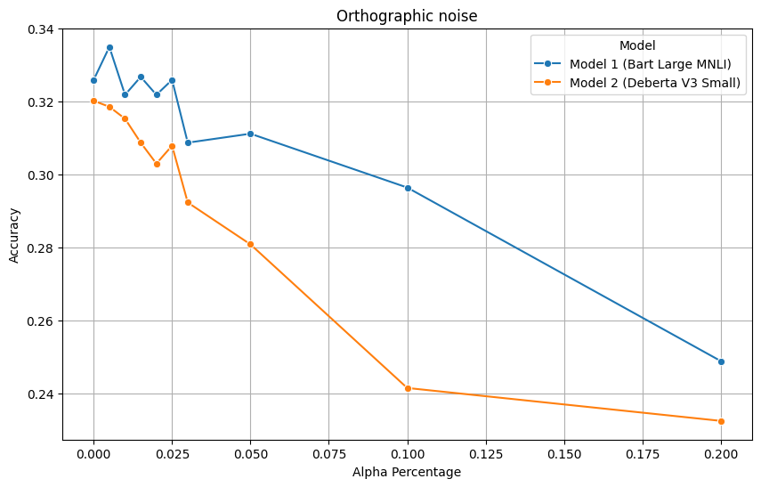

# DEVELOPMENT OF A METRIC FOR ROBUST MODEL EVALUATION WITH NOISE ADDED DATA

### ABSTRACT
This work introduces 'ProposedMetric,' a new measurement designed to evaluate how well large language models perform when faced with noisy data. The insights from this study suggest the idea that the use of noise or text perturbations can be beneficial and employed for model evaluation. Using the CommonsenseQA dataset, this metric was applied to test two widely used models, examining their ability to handle errors in text. The findings show that ProposedMetric is effective in assessing the robustness of these models and also useful in improving how they are trained. This research provides a practical tool for the research community, aimed at developing more reliable and adaptable LLMs for real-world applications.

### Experiments summary
For testing Proposed metric on 1221 questions from CommonsenceQA dataset with text perturbations two generative models from Python transformers library were used: facebook/bart-large-mnli and , nli-deberta-v3-small.

